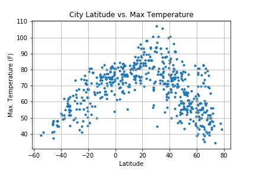

# Python_APIs

### Objectives
Python script that visualizes the weather of 500+ cities across the world of varying distance from the equator.

__Using citypy Python library and the OpenWeatherMap API:__
* Randomly select at least 500 unique (non-repeat) cities based on latitude and longitude.
* Perform a weather check on each of the cities using a series of successive API calls.
* Include a print log of each city as it's being processed with the city number and city name.

__Build a series of scatter plots to showcase the following relationships:__
* Temperature (F) vs. Latitude
* Humidity (%) vs. Latitude
* Cloudiness (%) vs. Latitude
* Wind Speed (mph) vs. Latitude

__Save both a CSV of all data retrieved and png images for each scatter plot__

